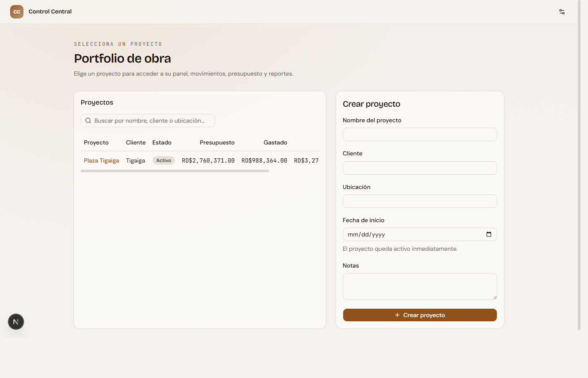
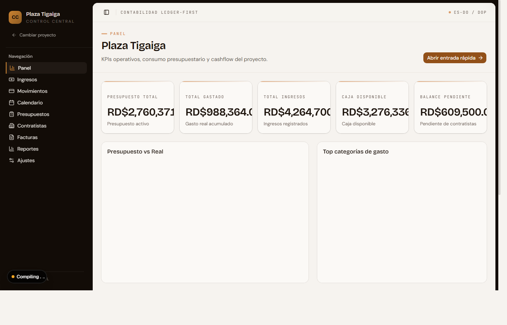
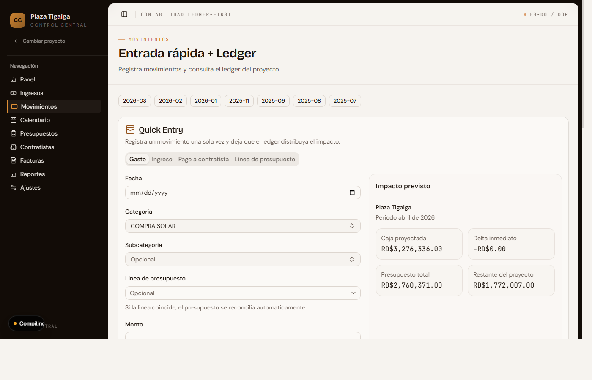
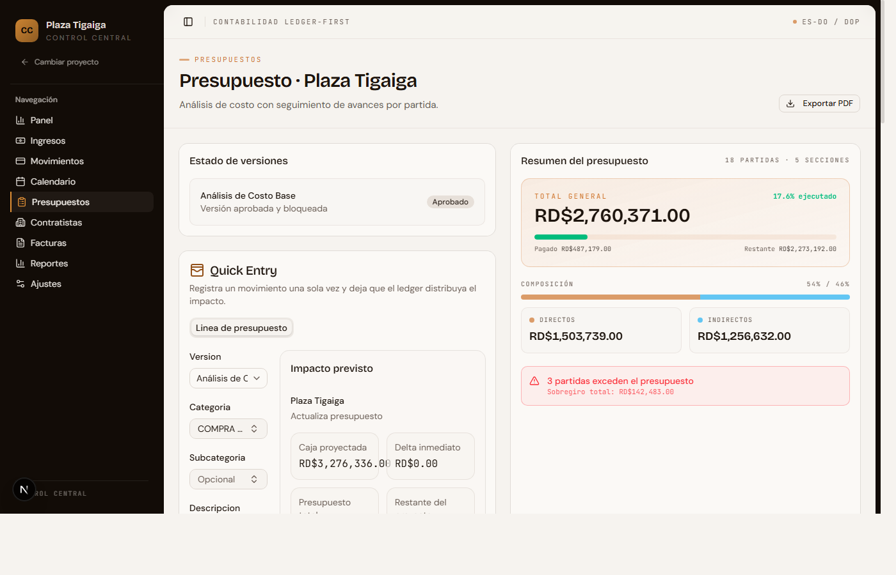
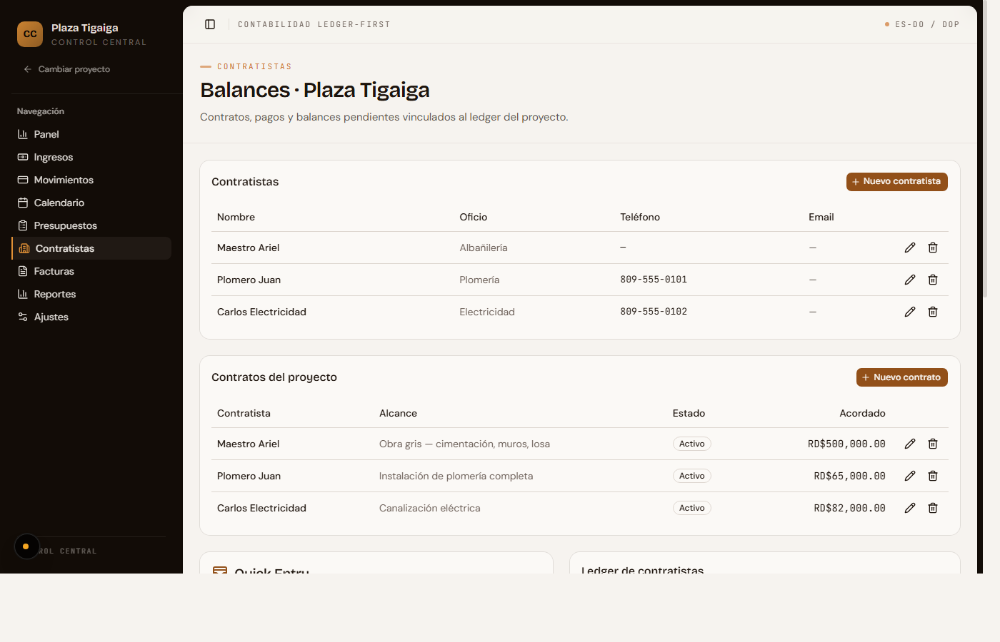
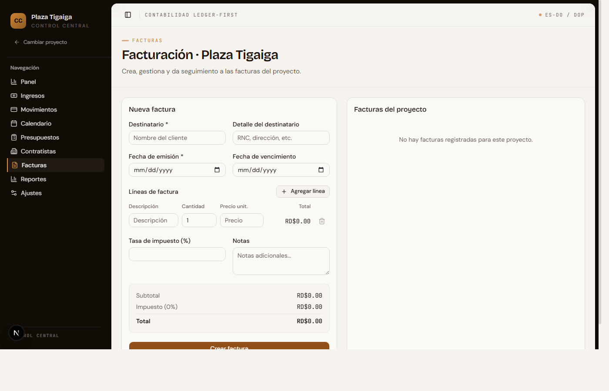
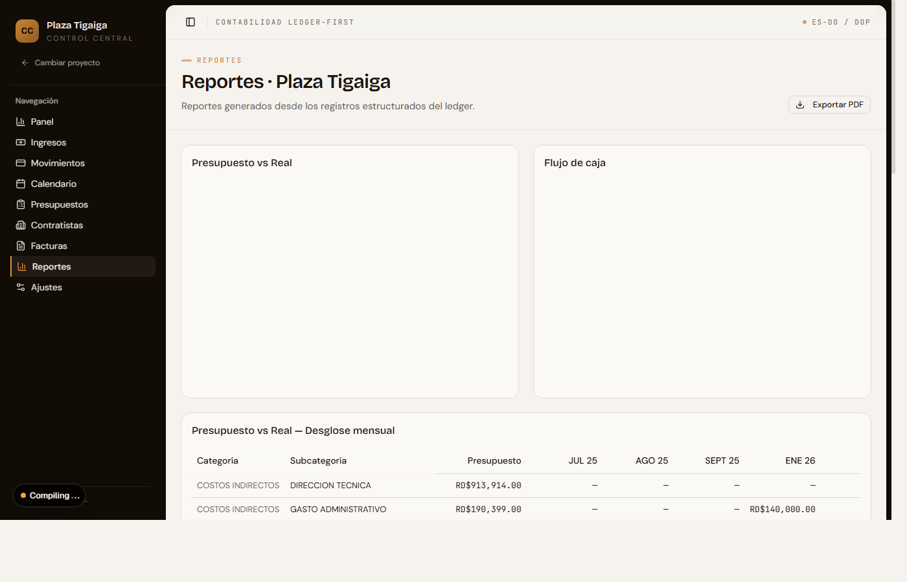
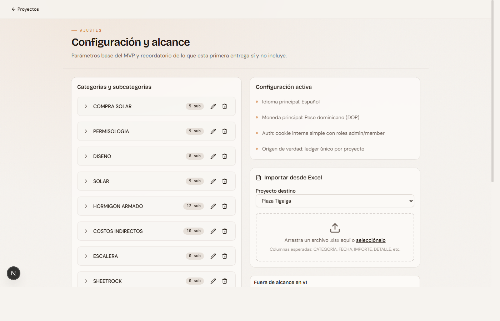

<p align="center">
  
</p>

<h1 align="center">Control Central</h1>

<p align="center">
  <strong>Desktop financial control app for construction firms</strong><br/>
  Offline-first &middot; Windows &middot; Spanish UI &middot; Auto-updates from GitHub
</p>

<p align="center">
  
  
  
  
</p>

---

## What is this?

**Control Central** is a desktop application built for Dominican Republic construction firms to manage project finances — budgets, transactions, contractor payments, invoicing, and reporting. All in Spanish, all in Dominican Pesos (DOP), all offline.

It runs as a portable Windows `.exe` (no installer needed) and stores data locally in `%APPDATA%\Control Central\`. The app checks GitHub Releases for updates on every launch and can self-update with one click.

---

## Features

### Project Portfolio

View all construction projects at a glance — status, total budget, spending, and cash position. Create new projects with a single form.

<p align="center">
  
</p>

---

### Project Dashboard

KPI cards showing budget totals, expenses, income, cash balance, and pending receivables. Includes budget-vs-actual and category spend charts.

<p align="center">
  
</p>

---

### Quick Entry + Ledger

Fast transaction entry with real-time impact preview — see exactly how each entry affects the project's budget, cash position, and contractor balances before saving. Full searchable ledger with filters by date, category, and type.

<p align="center">
  
</p>

---

### Budget Management

Create budget versions with line-by-line cost breakdowns organized by construction category (hormigon armado, electricidad, plomeria, etc.). Track approved vs. actual spending with color-coded progress bars.

<p align="center">
  
</p>

---

### Contractor Balances

Manage contractors and their contracts. Track payments, balances, and outstanding amounts across all active contracts per project.

<p align="center">
  
</p>

---

### Invoicing

Create and track invoices with line items, tax calculations (ITBIS), and status workflow. Generate PDF invoices for clients.

<p align="center">
  
</p>

---

### Reports

Budget vs. actual analysis, cashflow tracking, and category spend breakdowns — all generated from the live ledger data. Export to PDF and Excel.

<p align="center">
  
</p>

---

### Settings

Manage the chart of accounts — categories and subcategories used across budgets and transactions. Import data from Excel spreadsheets.

<p align="center">
  
</p>

---

## Tech Stack

| Layer | Technology |
|-------|-----------|
| **Desktop shell** | Electron 33 |
| **Web framework** | Next.js 16 (App Router, standalone mode) |
| **UI** | React 19, Tailwind CSS 4, shadcn/ui |
| **Data** | JSON file store (`%APPDATA%\Control Central\finance-store.json`) |
| **Validation** | Zod v4 |
| **Charts** | Recharts |
| **PDF/Excel** | jsPDF + jspdf-autotable, xlsx |
| **Updates** | GitHub Releases API + self-replacing batch updater |
| **CI/CD** | GitHub Actions (tag-triggered Windows build) |

---

## Getting Started

### Development

```bash
npm install
npm run dev              # Next.js dev server (Turbopack)
npm run electron:dev     # Full Electron + Next.js dev mode
npm run test             # Vitest
npm run lint             # ESLint
```

### Build & Package

```bash
npm run dist:zip         # Full pipeline: build → package → zip
```

This produces `dist-electron/Control-Central-windows-x64.zip` (~116 MB) — a portable Windows application ready to distribute.

### Release a new version

```bash
# 1. Bump version
npm version patch        # 0.1.0 → 0.1.1

# 2. Push tag to GitHub
git push --follow-tags
```

GitHub Actions builds the ZIP on a Windows runner and publishes it as a release asset. The client's app detects the new version on next launch and offers a one-click update.

---

## Project Structure

```
├── electron/
│   ├── main.ts              # Electron main process + app menu
│   ├── updater.ts           # GitHub-based auto-updater
│   └── client-README.txt    # Spanish instructions shipped with the app
├── src/
│   ├── app/                 # Next.js App Router pages
│   │   ├── (app)/           # Protected app routes (force-dynamic SSR)
│   │   └── api/             # API routes (receipts, exports)
│   ├── features/finance/    # Core domain
│   │   ├── ledger.ts        # Types + pure functions
│   │   ├── store.ts         # Lazy-initialized persistence
│   │   ├── persistence.ts   # JSON file read/write
│   │   ├── schemas.ts       # Zod validation
│   │   ├── actions.ts       # Server actions
│   │   └── seed.ts          # Initial data + clean-slate variant
│   ├── components/
│   │   ├── ui/              # shadcn primitives
│   │   ├── projects/        # Project-level UI
│   │   ├── reports/         # Chart components
│   │   ├── settings/        # Category management
│   │   └── shared/          # Reusable components
│   └── hooks/               # Client hooks
├── scripts/
│   ├── copy-standalone-assets.mjs  # Post-build asset copy + scrubber
│   ├── package-electron.mjs        # @electron/packager wrapper
│   └── zip-dist.mjs                # PowerShell zip creator
├── .github/workflows/
│   └── release.yml          # Tag-triggered release pipeline
└── supabase/                # Future Postgres schema (not connected)
```

---

## How the Updater Works

```
App launches → checks GitHub /releases/latest
  → compares semver with current version
  → if newer: shows Spanish dialog "Versión vX.Y.Z disponible"
  → user clicks "Actualizar ahora"
  → downloads ZIP with progress bar
  → writes updater.cmd to %TEMP%
  → spawns updater.cmd (detached) and quits
  → updater.cmd waits for .exe to exit
  → extracts ZIP, robocopy /MIR into install dir
  → relaunches Control Central.exe
```

User data in `%APPDATA%\Control Central\` is never touched by updates.

---

## Configuration

Set your GitHub repo in `package.json` so the updater knows where to check:

```json
"updater": {
  "owner": "YOUR_GITHUB_USERNAME",
  "repo": "construction-firm-app",
  "assetName": "Control-Central-windows-x64.zip"
}
```

---

## License

Private — not open source.
